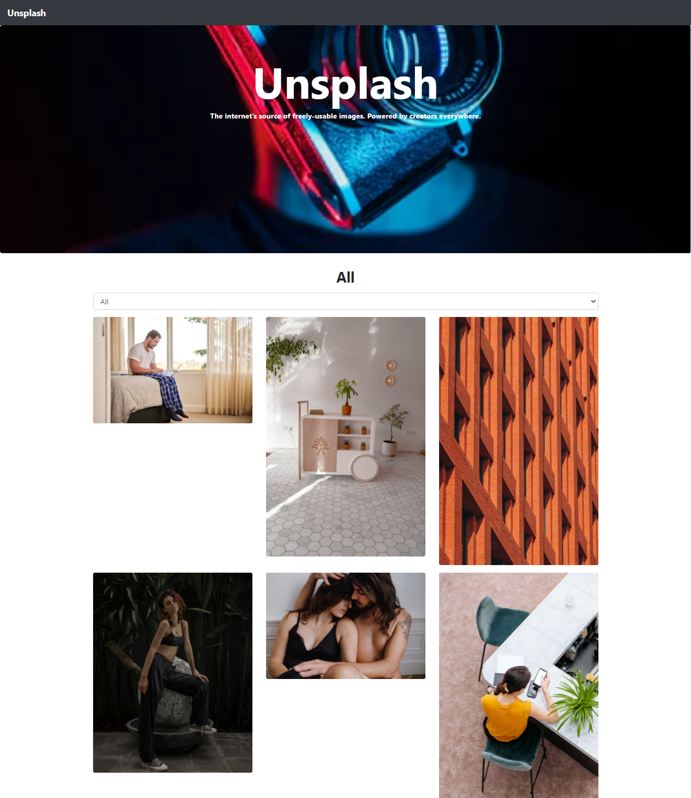

# Catalog of photos
The project I built is a clone of Unsplash. It's based on a catalog of photos. It is not Unsplash itself because I didn't build any payments or user authentication. I just wanted to build a catalog, that is, a browsable list of photos that you can filter and access to the details of one photo.

## Project screenshot

##  Built with

- ReactJS
- create-react-app
- Bootstrap
- React testing library
- Jest
- Netlify

##  Our Project

Our project can be found at https://github.com/daviidy/stock_photos

## Live Demo

You can find the demo [here](https://compassionate-noether-1b33d4.netlify.app/)

## To run the project in local

- make sure you have have NodeJS and NPM installed in your computer
- clone the repository from here [repo link](https://github.com/daviidy/stock_photos)
- navigate in your terminal to the folder `stock_photos`
- run `yarn install`
- run `yarn start`

## Available Scripts

In the project directory, you can run:

### `yarn start`

Runs the app in the development mode.\
Open [http://localhost:3000](http://localhost:3000) to view it in the browser.

The page will reload if you make edits.\
You will also see any lint errors in the console.

### `yarn test`

Launches the test runner in the interactive watch mode.\
See the section about [running tests](https://facebook.github.io/create-react-app/docs/running-tests) for more information.

### `yarn build`

Builds the app for production to the `build` folder.\
It correctly bundles React in production mode and optimizes the build for the best performance.

The build is minified and the filenames include the hashes.\
Your app is ready to be deployed!

See the section about [deployment](https://facebook.github.io/create-react-app/docs/deployment) for more information.

### `yarn eject`

**Note: this is a one-way operation. Once you `eject`, you can’t go back!**

If you aren’t satisfied with the build tool and configuration choices, you can `eject` at any time. This command will remove the single build dependency from your project.

Instead, it will copy all the configuration files and the transitive dependencies (webpack, Babel, ESLint, etc) right into your project so you have full control over them. All of the commands except `eject` will still work, but they will point to the copied scripts so you can tweak them.

##   Creators

 **Author**

- Github: [@daviidy](https://github.com/daviidy)
- Twitter: [@davidyao3](https://twitter.com/DavidYao3)
- LinkedIn: [@daviidy](https://www.linkedin.com/in/david-yao-6bb95299/)
- Personal Website: [@daviidy](http://david-yao.com)

##  Contributing

Contributions, issues and feature requests are welcome!

## Show your support

Give a ️ if you like this project!

##  License

This project is no licensed.
